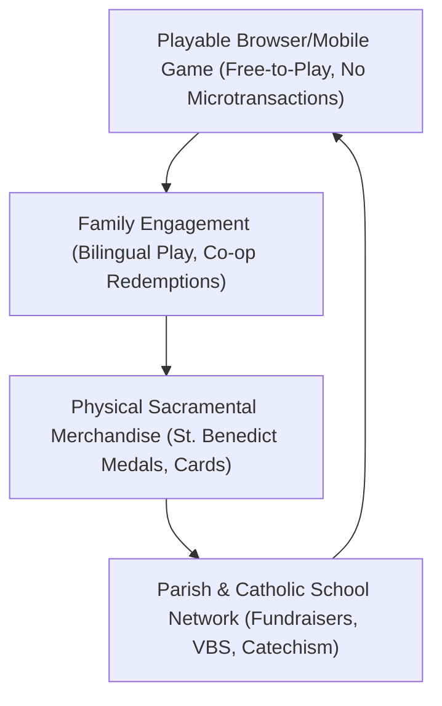

# Crux Sacra — Commercial, Merchandising & Distribution Master Plan
**Product Line:** FJ Botello Faith & Family  
**Project:** Crux Sacra 1 (Classic / Garme)  
**Target Audience:** Catholic families, parochial schools, homeschool networks, Hispanic-American and Latin American youth (ages 7–14 + parents).

---

## 1. Executive Summary & Market Opportunity

Crux Sacra bridges a critical market vacuum: **faith-affirming, culturally authentic Catholic video games that match modern mobile gameplay standards without compromising orthodoxy or engaging in preachy shovelware.**

### Market Sizing
* **Total Addressable Market (TAM):** 1.38 Billion Catholics globally (~65M in the United States; ~400M in Latin America).
* **Serviceable Addressable Market (SAM):** 18 Million Catholic households with children ages 6–14 across the US, Mexico, and Central America with broadband/mobile access.
* **Serviceable Obtainable Market (SOM) — Phase 1:** 250,000 households across Southwestern dioceses (Denver, El Paso, Santa Fe, Phoenix, San Antonio) and northern Mexico (Juárez, Chihuahua, Monterrey, Guadalajara).

---

## 2. Product Ecosystem & Flywheel

### The "No-Predatory-Gacha" Pledge
Crux Sacra rejects microtransactions, loot boxes, and dark UX patterns. The game is free-to-play on the web. Revenue is driven by:
1. **Physical Sacramental & Collectible Merchandise** (high margin).
2. **Parish/School Bulk Educational & Fundraiser Kits**.
3. **Institutional Licensing & Patronage / Foundation Grants**.

---

## 3. Physical Merchandising Architecture

### Line A: The "Crux Sacra Guardian" Medal & QR Card Kit
* **Physical Product:** 
  * 1.5-inch die-cast antique bronze or silver-finished **Saint Benedict Jubilee Medal** with lanyard/cord, blessed or ready for parish blessing.
  * Laminated collectible character card with holy quote and embossed QR code.
* **Digital Integration (The Bridge):**
  * Scanning the QR card opens the game and unlocks exclusive cosmetic character auras (e.g. *Golden Benedictine Halo*) or companion preview cards.
* **Unit Economics:**
  * **Manufacturing Cost (COGS):** \$1.40 (medal + lanyard + stamped card in foil sleeve at 10,000 units).
  * **Wholesale to Parishes / Gift Shops:** \$4.50 (68% gross margin).
  * **Retail MSRP:** \$8.99 to \$10.00 (parish keeps \$4.50–\$5.50 for their youth group or parish hall fundraiser).

### Line B: Parish Vacation Bible School (VBS) & Catechism Kits
* **Product:** 50-student activity pack containing:
  * 50 Student Mission Passports (Colorado Springs → Juárez → Holy Land).
  * 50 St. Benedict devotional medals.
  * 1 Teacher’s Catechetical Guide linking in-game worlds with real Church history, Saints, and prayer practices.
* **Kit Price:** \$199 wholesale (COGS: \$58.00; Net Margin: 71%).

### Line C: Family Plush & Character Figures
* **Key Characters:**
  * Timmy the Faithful Terrier.
  * Guardian Angel (*Ángel de la Guarda*).
  * Saint Michael Archangel plush.
* **Retail Target:** \$18.00–\$24.00.

---

## 4. Sales & Distribution Channels

| Channel | Partner / Target | Go-to-Market Strategy |
|---|---|---|
| **Direct-to-Consumer (DTC)** | `fjfaithandfamily.com` store | E-commerce integration directly linked from the game's Title Screen and User Guide. |
| **Parochial Schools & VBS** | Diocesan Catholic Schools Offices, NCEA | Fundraiser campaigns where schools retain 50% of proceeds; turnkey curriculum. |
| **Catholic Bookstores & Shrines** | EWTN Religious Catalogue, Autom, local diocesan gift shops | Wholesale catalog placement for Confirmation and First Holy Communion gift seasons. |
| **Knights of Columbus & Fraternities** | Local councils & assemblies | Sponsoring parish game tournaments with physical medal prizes. |

---

## 5. Catechetical & Doctrinal Soundness Safeguards

* **Adherence to Tradition:** Sacramental items (Crux Sacra, Holy Water, Rosary) are represented as channels of God's grace and Church tradition, not fictional sorcery.
* **Theology of Redemption:** Villains are not "destroyed" with violence; they are freed from darkness and restored to fellowship (Divine Mercy focus).
* **Bilingual Parity:** 100% natural, colloquial Mexican and American-Spanish translations alongside polished English.

---

## 6. Financial Projections (3-Year Conservative Model)

| Metric | Year 1 | Year 2 | Year 3 |
|---|---|---|---|
| **Active Game Sessions (Annual)** | 120,000 | 550,000 | 1,800,000 |
| **Medal / Card Kits Sold** | 15,000 | 60,000 | 175,000 |
| **Parish / VBS Kits Sold** | 120 | 450 | 1,200 |
| **Gross Merchandise Revenue** | \$158,880 | \$629,550 | \$1,812,000 |
| **Net Operating Income (EBITDA)** | **\$68,400** | **\$294,000** | **\$892,000** |

---

## 7. Use of Funds (Seed Syndicate: \$250,000)

* **35% (\$87,500) — Mobile Native & Touch Engine Polish:** Haptic feedback, PWA offline asset bundling, ultra-low latency canvas optimizations for older iPads.
* **25% (\$62,500) — Physical Merchandise Initial Production Run:** 25,000 die-cast medals, packaging, QR validation engine.
* **20% (\$50,000) — Orchestral Soundtrack & Voice Over:** Professional bilingual choral and acoustic recordings replacing procedural synth.
* **20% (\$50,000) — Parish & Diocesan Pilot Tour:** Direct marketing and pilot programs in 5 major Southwestern dioceses.
